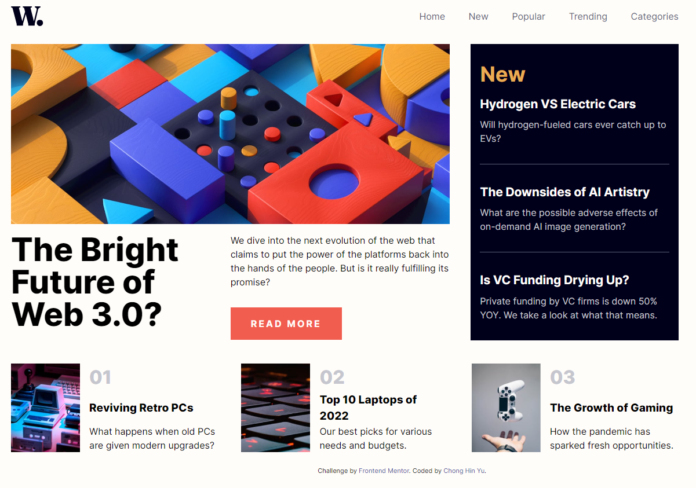

# Frontend Mentor - News homepage solution

This is a solution to the [News homepage challenge on Frontend Mentor](https://www.frontendmentor.io/challenges/news-homepage-H6SWTa1MFl). Frontend Mentor challenges help you improve your coding skills by building realistic projects. 

## Overview
Completed the News homepage using React, Tailwind CSS and using the React-Burger-Menu library.

I used Grid to layout the page and flexbox for the children elements. This page was created using a mobile first approach.

The navbar menu changes based on the screen size, so you will have burger menu in mobile and the standard nav bar menu on desktop.

### The challenge

Users should be able to:

- View the optimal layout for the interface depending on their device's screen size
- See hover and focus states for all interactive elements on the page

### Screenshot

Mobile
 

Mobile menu open
 

Desktop
 

Desktop Navbar active
 

Desktop Read more button active
 

Desktop aside active
 

Desktop list articles active
 

### Links

- Live Site URL: [News Homepage](https://hin274.github.io/news-homepage-main/)

## Author

- Frontend Mentor - [@hin274](https://www.frontendmentor.io/profile/Hin274)

